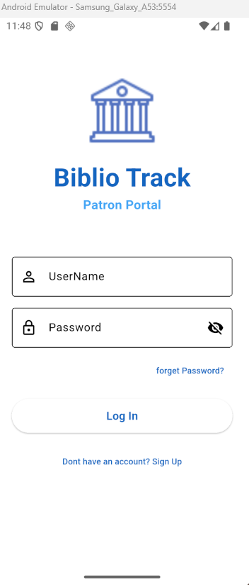
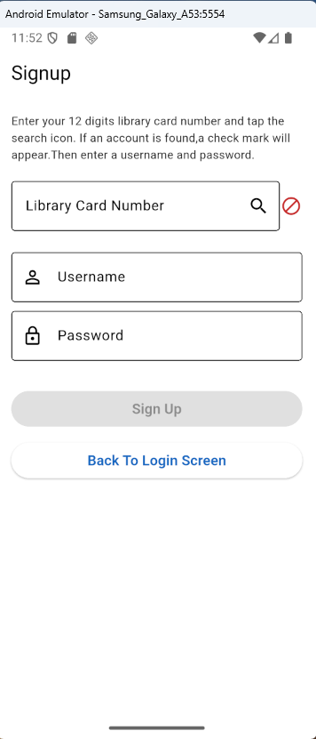
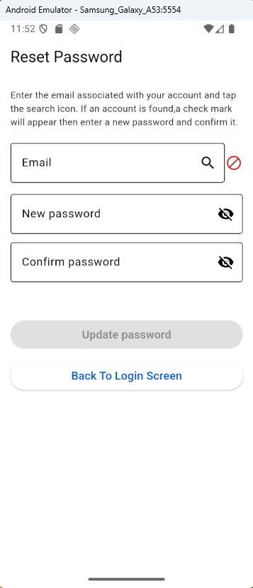
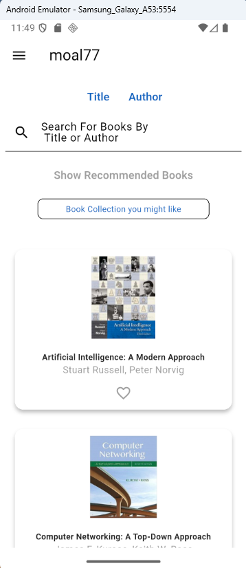
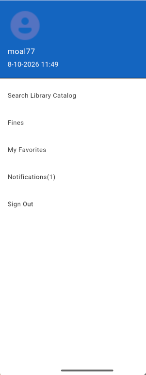
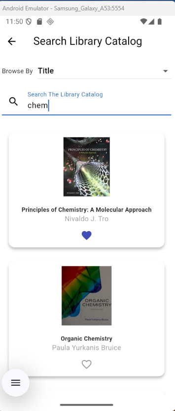
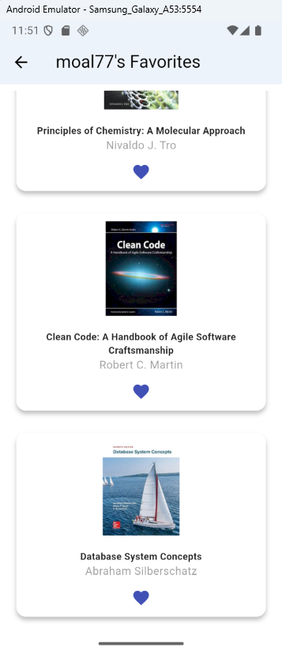
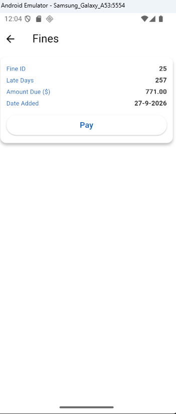
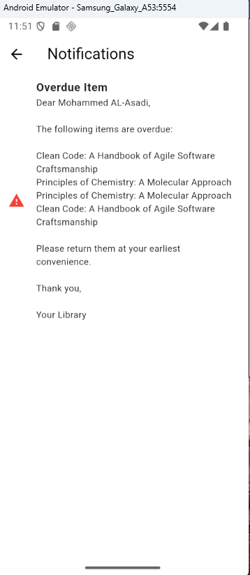
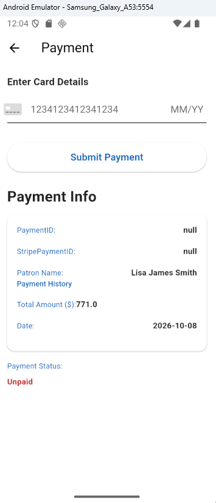

# 📖 BiblioTrackPatronPortal

> A full-stack library patron portal  mobile application built with **Flutter** (MVVM + Provider) and **.NET 8 RESTful API** (3-Tier Architecture with Enitity framework & MS SQL Server).

## 📝 Overview

**BiblioTrackPatronPortal** is a multi-tier library patron portal mobile solution designed to 
facilitate library member to create an online account where they can manage their favorites,recieve and manage overdue items and reservation notifications,pay fines, search library OPAC. 

## ✨ Key Features
- **User Authentication:** login
- **Signup:** validation by patron library card number before creating an online account
- **Password Recovery:** validation by patron Email & reset mechanism.
- **Interactive Dashboard:**
    Shows some recommendations based on the patron favorites.
    Quick search by Title or Authors 
- **Favorites Management:** add/remove books to patron facorites.
- **Fines/Payment Management:** List unapid fines and the ability to pay those fines using Stripe SDK 

## 🛠 Architecture

### **Frontend (Flutter Mobile Application)**
- **Framework:** Flutter (Dart)
- **Architecture Pattern:** Model-View-ViewModel (**MVVM**) with Repository & Service Layers.
- **Dependency Injection:** Service/Repository Interface-Implementation decoupling.
- **State Management:** `Provider` package.

Backend (.NET 8 Web API)
Framework: ASP.NET Core RESTful API (.NET 8)

Architecture: Classic 3-Tier Architecture

API Layer (BiblioTrack_PatronPortal): REST Controllers.

Business Logic Layer (PatronPortal_BusinessLogicLayer): Core domain models 

Data Access Layer (PatronPortal_DataAccessLayer): database operations built with entity framework 

Database Engine: Microsoft SQL Server .

🚀 Getting Started & Installation Prerequisites

 Flutter SDK: >=3.0.0

.NET SDK: 8.0

Database: Microsoft SQL Server (SQL Express, or Full Instance)

IDE: Visual Studio (Backend) & Visual Studio Code (Frontend)

🚀 How to Run:

Clone the repository:git@github.com:HAJS78/BiblioTarck-v1-PatronPortal.git

1. Database Setup
Open SQL Server Management Studio (SSMS).

Connect to your SQL Server instance.

Open and run the .sql script inside the DatabaseScript/ folder to generate tables and schema.

2. Backend API Setup (.NET 8)

Open Backend/BiblioTarck_PatronPortal/BiblioTrack_PatronPortal.sln in Visual Studio 

Update the connection string in Backend/BiblioTrack_PatronPortal/BiblioTrack_PatronPortal
/appsettings.json 

"ConnectionStrings": {

    "BiblioTrackv1": "Server= Your local host;Database=Your Database Name;Trusted_Connection=True;TrustServerCertificate=True;"

  },

The backend also integarte with another C# RESTful API payment gateway to process fines payment

to use this gateway:

Clone the repository: git@github.com:HAJS78/Payment-Gateway.git 

Follow any installation instructions for the gateway using its README.md file

In Backend/BiblioTrack_PatronPortal/BiblioTrack_PatronPortal
/appsettings.json update 

"PaymentGateway": {
    
    "BaseUrl": "http://localhost:5150/"
  }

Build PaymentGateway

Build BiblioTrack_PatronPortal

3. Frontend Setup (Flutter)

Select open folder in Visual Studio Code and navigate to biblio_track_patron_portal

Update the REST API endpoint URL inside your lib/Data/Network/dio_client.dart

static const String _baseUrl = 'http://10.0.2.2:5224/api'

Select an Emulator 

Start Debugging (before that you must make sure that the backend .NET app is running,
both PaymentGateway and BiblioTrack_PatronPortal.It acts as the server)

## 🖼️ Screenshots

Screenshots are located in the **`ScreenShots`** folder.

### Authentication & Account Management

#### Login Screen

#### Signup Screen

#### Reset Password

### Patron Portal Services

#### User Dashboard

#### User Dashboard Items

#### Catalog Search

#### Favorites Management

#### Fines Management

#### Notifications Management

#### Payment Management

## 🛠 Tech Stack 

Frontend : Flutter (Dart)
Backend  : ASP.NET Core RESTful API (.NET 8)
Database Engine: Microsoft SQL Server .

📜 License

This project is licensed under the MIT License —See LICENSE.md 

## 📅 Timeline

- Started:   July 2026 (16/7/2026)  
- Completed: October 2026  (2/10/2026) 
